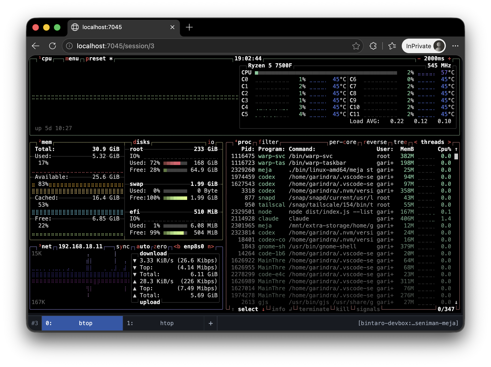

<h1 align="center">seniman-meja</h1>

<div align="center">
  
</div>

## Overview

`seniman-meja` lets you control your [Meja](https://github.com/garindra/meja) sessions through a web browser on desktop or mobile, without needing a terminal app. Built with [Seniman](https://github.com/senimanjs/seniman), it renders each session as a lightweight DOM terminal with window switching, keyboard and touch input, resizing, scrolling, clipboard integration, and Meja's client-side prompts.

## Installation

You need:

- Node.js 18 or newer.
- A running Meja v0.0.23 server or later.

From a local checkout of this repository, install its dependencies and install the command globally:

```sh
npm install
npm install -g .
```

## Running

### Locally

Start `seniman-meja` on the computer where the Meja server is running. By default, it connects to the local default Meja profile:

```sh
seniman-meja
```

Then open [http://127.0.0.1:7045](http://127.0.0.1:7045).

Meja transport options intentionally mirror the native client where practical:

```text
-L <profile>           select a named Meja server profile
-S <socket-path>       select an exact Meja server socket
```

Use `-p` or `--web-port` to change the local web port:

```sh
seniman-meja -p 9000
```

Run `seniman-meja --help` for the complete command-line reference.

### Password protection

`seniman-meja` requires a web access password every time it starts. The
password is prompted for interactively so it does not appear in the command
line or shell history:

```sh
seniman-meja
```

After signing in through the browser, the application uses an HTTP-only session
cookie to authenticate both page requests and WebSocket connections. Sessions
expire after 12 hours or when `seniman-meja` stops.

Password protection applies to the browser frontend. A process running as the
same Unix user may still connect directly to the Meja server socket.

### Exposing externally

Exposing `seniman-meja` externally is a powerful way to interact with your Meja sessions remotely using the standard web browser on another computer, phone, or tablet. However, it requires extra care: access to `seniman-meja` should be treated as access to an interactive shell. A connected user can read terminal output, send keystrokes, run commands, and access clipboard data exposed by the session.

Thankfully, solutions such as Tailscale and Cloudflare Tunnel make it easier to provide remote access safely without opening the service directly to the internet. The sections below show how to use either option.

By default, `seniman-meja` listens only on `127.0.0.1` and accepts browser origins only for `localhost` and `127.0.0.1`.

If the browser is on the same laptop, keep this default. You do not need Tailscale, Cloudflare Tunnel, a public listening address, or an open firewall port.

When the browser is on another computer or device, the connection must use an encrypted transport. The Tailscale and Cloudflare Tunnel configurations below provide one. If you use neither, put `seniman-meja` behind an HTTPS reverse proxy or another encrypted VPN or tunnel. The built-in password authenticates the user but does not encrypt the connection, so never expose it over ordinary LAN or public HTTP. Direct HTTP to a Tailscale IP is acceptable because Tailscale encrypts traffic between its nodes end to end, although the browser will still treat the page as an insecure context.

If you deliberately make the browser frontend available through a reverse proxy, add only its exact browser hostname:

```sh
seniman-meja --allow-origin terminal.example.com
```

Pass the hostname only—without `https://`, a port, or a path. The option is repeatable. It permits the browser's WebSocket origin but is **not authentication** and does not change the localhost-only listening address.

#### Tailscale

When using Tailscale, [Tailscale Serve](https://tailscale.com/docs/features/tailscale-serve) is the recommended option. It proxies the localhost service over HTTPS within your tailnet, so `seniman-meja` does not need to listen on a Tailscale or LAN address.

Before enabling Serve, review your [tailnet access controls](https://tailscale.com/docs/features/access-control) and permit only your Tailscale identity or trusted devices to reach this device. The default tailnet policy is permissive. The built-in password remains required, while restrictive tailnet rules provide an additional layer and prevent untrusted tailnet users from reaching the login page at all.

Use the exact MagicDNS hostname assigned to the device:

```sh
seniman-meja \
  --allow-origin laptop.your-tailnet.ts.net

tailscale serve --bg 7045
```

Open the HTTPS URL printed by Tailscale. Tailnet access rules still apply, and `seniman-meja` remains bound to localhost. Do not use Tailscale Funnel for this purpose; Funnel exposes the service to the public internet.

The `--bg` configuration persists and resumes after a reboot. Disable it when remote access is no longer required:

```sh
tailscale serve off
```

For direct access without Tailscale Serve, explicitly bind `seniman-meja` to the device's Tailscale IP and allow that IP as a browser origin:

```sh
seniman-meja \
  --listen 100.64.0.10 \
  --allow-origin 100.64.0.10
```

Then open `http://100.64.0.10:7045`. This method expands the service's listening interface and does not provide browser HTTPS, so prefer Serve when possible. Traffic between Tailscale nodes is nevertheless encrypted end to end. Restrict TCP port `7045` to your identity or trusted devices in the tailnet policy. `--listen` accepts only a specific local IP address; wildcard addresses such as `0.0.0.0` and `::` are rejected.

#### Cloudflare Tunnel with single-email access

This configuration uses Cloudflare Access to restrict the application to one explicitly specified email address.

First, choose a hostname, such as `terminal.example.com`, and start `seniman-meja` with that exact hostname:

```sh
seniman-meja \
  --allow-origin terminal.example.com
```

Before publishing the tunnel route, create a [Cloudflare Access self-hosted application](https://developers.cloudflare.com/cloudflare-one/access-controls/applications/http-apps/self-hosted-public-app/) for the hostname. Configure a single Access policy as follows:

| Setting | Value |
| --- | --- |
| Action | Allow |
| Rule | Include |
| Selector | Emails |
| Value | Your exact email address, such as `you@example.com` |

Use the **Emails** selector, not **Emails ending in**, **Everyone**, or another broad selector. Ensure that no additional Allow or Bypass policy grants access to other identities.

Next, create a Cloudflare Tunnel and add a published application route from `terminal.example.com` to `http://127.0.0.1:7045`. Enable **Protect with Access**, then install or run `cloudflared` using the command provided by Cloudflare.

Keep `seniman-meja` bound to localhost. Accessing `https://terminal.example.com` will then require authentication with the one email address specified in the Access policy. See the official [Cloudflare Tunnel setup guide](https://developers.cloudflare.com/tunnel/setup/) for detailed tunnel setup.
